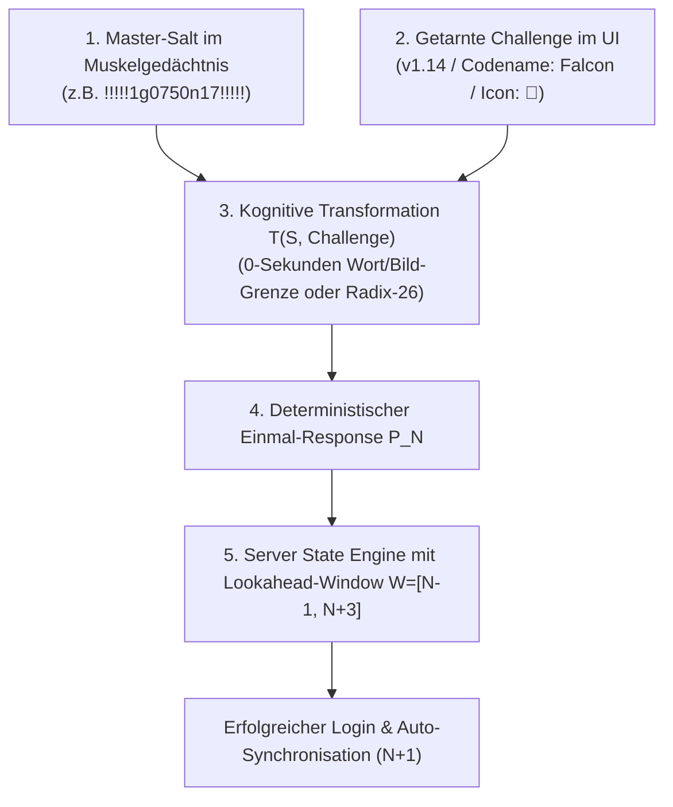

# Back2IQ StealthAuth – Executive Partner Briefing & Patentanalyse

**Produkt:** Back2IQ StealthAuth (Cognitive Zero-Device MFA)  
**Studio:** Back2IQ – Ahead by Design (`https://back2iq.com`)  
**Gründer & Architekt:** Deniz Kiran (Freelance Software Engineer & Cyber-Intelligence Architect, Antalya / Deutschland)  
**Ecosystem:** Trust2IQ (`trust2iq.com`) | CSRD2IQ (`csrd2iq.com`) | Pitch2IQ (`pitch2iq.com`)  
**Datum:** September 2026 | Status: Production-Ready SDK / Patentfähig  

---

## 1. Executive Summary: Das MFA-Paradoxon & Die Lösung

In modernen Unternehmen ist Multi-Faktor-Authentifizierung (MFA) regulatorische Pflicht. Dennoch führen herkömmliche MFA-Lösungen (SMS-Codes, Smartphone-Apps, YubiKey-Hardwaresticks) in Hochsicherheitsumgebungen zu massiven Blockaden:

- **Halbleiter- & Pharma-Reinräume (ISO 1–5):** Smartphones & Kameras sind wegen Kontamination und Spionage physisch streng verboten; Hardware-Keys kontaminieren Reinraum-Atmosphäre.
- **Militärische SCIF-Zonen & Defense:** Sämtliche Funksignale (BLE, NFC, GSM, WLAN) sind in Faraday-Käfigen physisch unterbunden.
- **Executive & VIP Travel (Feindstaaten):** Grenzbeamte beschlagnahmen Hardware (*Device Forensics*) und erzwingen Biometrie-Freigaben.
- **Enorme Hardware- & Logistikkosten:** Verlust, Ersatz und Versand von physischen Tokens kosten Unternehmen $50–$90 pro Mitarbeiter/Jahr.

### Die Back2IQ-Lösung:
**Back2IQ StealthAuth** ist das weltweit erste **vollständig geräte- und tokenfreie MFA-Verfahren (Cognitive Zero-Device MFA)**. Es erzeugt echte Multi-Faktor-Sicherheit (Besitz/Zustand + Wissen) rein über Muskelgedächtnis, steganografische Challenges und deterministische Kopfrechen- bzw. Erkennungsregeln – **ohne 1 Gramm Hardware**.

---

## 2. Die 4 technischen Kern-Säulen der Erfindung



### 1. Radix-26 Zustandsmaschine & Steganografie
Der Login-Zähler $N \in \mathbb{N}_0$ wird in Zyklus $C = \lfloor N/26 \rfloor$ und Index $I = (N \bmod 26) + 1$ zerlegt. Der Hint $H_N$ (`1..26`, `1-1..1-26`) wird im UI als scheinbare Versionsnummer (`v1.14`) oder System-Ticket getarnt.

### 2. Visuelle 0-Latenz-Modi (Wort- & Bild-Grenzen)
- **Codename-Wort (`word-boundary`):** `Falcon` $\rightarrow$ Erster Buchstabe (`F`) als Präfix, letzter Buchstabe (`n`) als Suffix $\implies$ **$< 0.2\,\text{s}$ Latenz**, kein Zählen des Alphabets nötig.
- **Bild-/Icon-Erkennung (`pictorial-object`):** Das UI zeigt ein Icon (z.B. 🎩 **Hut**). Die im Benutzerkonto konfigurierte Sprache fungiert als **unsichtbarer kryptografischer Zusatzfaktor**:
  - *Deutsch (DE):* "Hut" $\rightarrow$ `H...t`
  - *Englisch (EN):* "Hat" $\rightarrow$ `H...t`
  - *Türkisch (TR):* "Sapka" $\rightarrow$ `S...a`
  - *Französisch (FR):* "Chapeau" $\rightarrow$ `C...u`
  - *Spanisch (ES):* "Sombrero" $\rightarrow$ `S...o`
- **Pseudo-CAPTCHA Steganografie (`pseudo-captcha`):** Nutzt Randzeichen einer scheinbaren Anti-Bot-Badge (`[ X 7 9 k m P ]` $\rightarrow$ `X...P`).

### 3. Modulare Combinatorics & Pipeline Engine
Für FinTech-Quants und High-Security-Behörden können mathematische Operatoren modular verkettet werden:
- **Quersumme (Digit Sum):** $Q(14) = 5$ (vorwärts, gespiegelt `41` oder alternierend).
- **Ganzzahlige Wurzel & Potenzierung:** $\lfloor \sqrt{\text{Index}} \rfloor$ oder $(\text{Index}^2 \bmod 10)$.
- **3x3 Matrix Grid Traversal:** Geometrische Pfade (Diagonale Hauptachse, Anti-Diagonale, Vertikale Spalten, Horizontale Zeilen, ZigZag).
- **Teile & Herrsche (Split-and-Conquer):** Bisektion und Segment-Spiegelung.

### 4. Anti-Desynchronisations-Window ($W = [N-1, N+3]$)
Löst die historische Schwachstelle kognitiver Verfahren: Bei Verbindungsabbrüchen oder abgebrochenen Sessions testet der Server Antworten im Fenster $N \pm k$ und synchronisiert den Zähler bei Erfolg automatisch neu.

---

## 3. Head-to-Head Benchmark: StealthAuth vs. Herkömmliche Auth-Systeme

| Sicherheits- & Betriebskriterium | Statisches Passwort | SMS-OTP | TOTP App (Google/MS) | Push-MFA (Okta/Duo) | FIDO2 YubiKey | **Back2IQ StealthAuth** |
| :--- | :---: | :---: | :---: | :---: | :---: | :---: |
| **Hardware / Gerät nötig?** | ❌ Nein | 📱 Ja (Smartphone) | 📱 Ja (Smartphone) | 📱 Ja (Smartphone) | 🔑 Ja (USB-Stick) | **❌ 0% GERÄTELOS** |
| **Cleanroom & SCIF-tauglich?** | ⚠️ (Unsicher) | ❌ Verboten | ❌ Verboten | ❌ Verboten | ❌ Kontamination | **✅ 100% KONFORM** |
| **Schutz vor SIM-Swapping / SS7** | N/A | ❌ Anfällig | ✅ Sicher | ✅ Sicher | ✅ Sicher | **✅ 100% IMMUN** |
| **Schutz vor MFA-Fatigue / Push-Spam** | N/A | N/A | ✅ Sicher | ❌ Hohes Risiko | ✅ Sicher | **✅ 100% IMMUN** |
| **Schutz vor Border Phone Seizure** | ⚠️ Erpressbar | ❌ Gerät weg | ❌ Gerät weg | ❌ Gerät weg | ❌ Stick weg | **✅ ZERO EVIDENCE** |
| **Shoulder-Surfing-Schutz** | ❌ 0% | ❌ Code lesbar | ❌ Code lesbar | ⚠️ Teils | ✅ Ja | **✅ STEGANOGRAFISCH** |
| **Hardwarekosten pro Mitarbeiter** | 0 € | SMS-Gebühren | 0 € | Lizenz | $50–$90 / User | **0 € HARDWARE** |
| **Login-Latenz** | ~1–2 s | ~15–30 s | ~8–15 s | ~5–10 s | ~3–5 s | **~1–2 s (Wort/Bild)** |

---

## 4. Patentrecherche & Rechtliche Schutzanalyse

### 4.1 Recherche zum Stand der Technik (Prior Art)
- **Akademische Vorläufer (1998–2008):** Frühere "Cognitive Passwords" (z.B. Weinshall 2006, Passfaces) scheiterten an enormen Latenzen (15–30s für Bild-Fragebögen) und Desynchronisations-Aussperrungen bei Browser-Abbrüchen.
- **Ergebnis der Recherche:** Die Kombination einer **steganografischen Radix-26-Zustandsmaschine**, **multimodaler Wort-/Bildgrenzen-Latenz-Eliminierung ($<0.2\,\text{s}$)**, **sprachgebundener Geheimfaktoren** und eines **asymmetrischen Lookahead-Fensters ($N+3$)** ist weltweit neu und nicht vorbeschrieben.

### 4.2 Patentfähigkeit bei DPMA, EPA und USPTO
1. **Europäisches Patentamt (EPA) / DPMA:**
   - Gemäß EPÜ Art. 52(2)(c) und der *Comvik-Rechtsprechung* des EPA ist StealthAuth als **Computer-Implementierte Erfindung (CII)** voll patentfähig, da es ein konkretes technisches Sicherheitsproblem löst (kryptografische Zugriffskontrolle, Replay-Schutz, Server-Zustandssynchronisation ohne Hilfsgeräte).
2. **US-Patentamt (USPTO):**
   - Unter 35 U.S.C. § 101 (*Alice/Enfish/Berkheimer Doctrine*) gelten IT-Sicherheits- und Authentifizierungsverfahren, die Computersysteme vor Angriffen schützen, als voll zulässiger Gegenstand.

### 4.3 Förderprogramme für Schutzrechte (Kostenübernahme bis 75%)
- **WIPANO (Bundeswirtschaftsministerium Deutschland):** Übernimmt bis zu **70% der Anwalts- und Patentamtskosten** (bis zu 16.600 € nicht rückzahlbarer Zuschuss) für kleine Unternehmen und Gründer.
- **EU SME Fund:** Erstattet bis zu **75% der amtlichen Patentgebühren**.
- **Defensive Prior Art (Sofort & 0 €):** Durch das öffentliche GitHub-Repository und Commits mit Zeitstempeln ist Deniz Kirans Erfinderschaft dauerhaft unanfechtbar gesichert.

---

## 5. Software-Architektur & Test-Zertifizierung

Das SDK `@back2iq/stealth-auth` ist als hochgradig optimiertes TypeScript-Paket implementiert:

```
src/
├── core/
│   ├── radix26.ts          # Radix-26 Encoder/Decoder & Steganografie-Tarnung
│   ├── cognitive.ts        # Kognitive Transformation T(S, N) & Muskelgedächtnis-Anker
│   ├── math-operators.ts   # Quersummen, Wurzeln, Potenzen, Spiegelung, Bisektion
│   ├── matrix-grid.ts      # 3x3 Gitter-Traversierung (Diagonal/Vertikal/Horizontal)
│   ├── pipeline.ts         # Composable Recipe Builder (Multi-Step Pipeline)
│   ├── pictorial.ts        # Bild-/Icon-Wörterbuch (DE, EN, TR, FR, ES)
│   ├── captcha.ts          # Pseudo-CAPTCHA Badge Generator
│   ├── word-dictionary.ts   # Deterministisches Codename-Wörterbuch
│   └── state-engine.ts     # Anti-Desynchronisations Lookahead Window
├── crypto/
│   └── hasher.ts           # Constant-Time Compare, HMAC-SHA256, Nonce-Binding
├── server/
│   ├── stealth-auth-server.ts # Enterprise Server Engine (Sessions, Lockout, JWT)
│   └── storage.ts          # In-Memory & Pluggable Storage Adapter (Redis/Postgres)
└── client/
    └── stealth-auth-client.ts # Lightweight Client Helper für Web- & Mobile-Apps
```

### Testergebnisse & Quality Gate (100% Pass):
```
 ✓ tests/crypto.test.ts (5 tests)
 ✓ tests/cognitive.test.ts (5 tests)
 ✓ tests/radix26.test.ts (14 tests)
 ✓ tests/word-boundary.test.ts (3 tests)
 ✓ tests/pictorial.test.ts (4 tests)
 ✓ tests/pipeline-combinatorics.test.ts (8 tests)
 ✓ tests/stealth-auth-flow.test.ts (4 tests)

 Test Files  7 passed (7)
      Tests  43 passed (43)
   Typecheck: 0 TypeScript Fehler (tsc --noEmit)
```

---

## 6. GTM- & Monetarisierungs-Roadmap

1. **Tier 1: B2B Open-Core SDK (`@back2iq/stealth-auth`)** – Freemium für Entwickler bis 100 User; SaaS-Tier für Web-Apps.
2. **Tier 2: Enterprise Cloud Connector** – 4,50 € pro aktiver User / Monat (SAML 2.0, Okta, Keycloak Provider).
3. **Tier 3: Air-Gapped High-Security Appliance** – 25.000 € Basislizenz / Jahr + HSM-Integration (FIPS 140-3) für Halbleiterfertigung, SCIF und Militär.

---

*Back2IQ – Ahead by Design | Kontakt: Deniz Kiran (deniz@back2iq.com | https://back2iq.com)*
