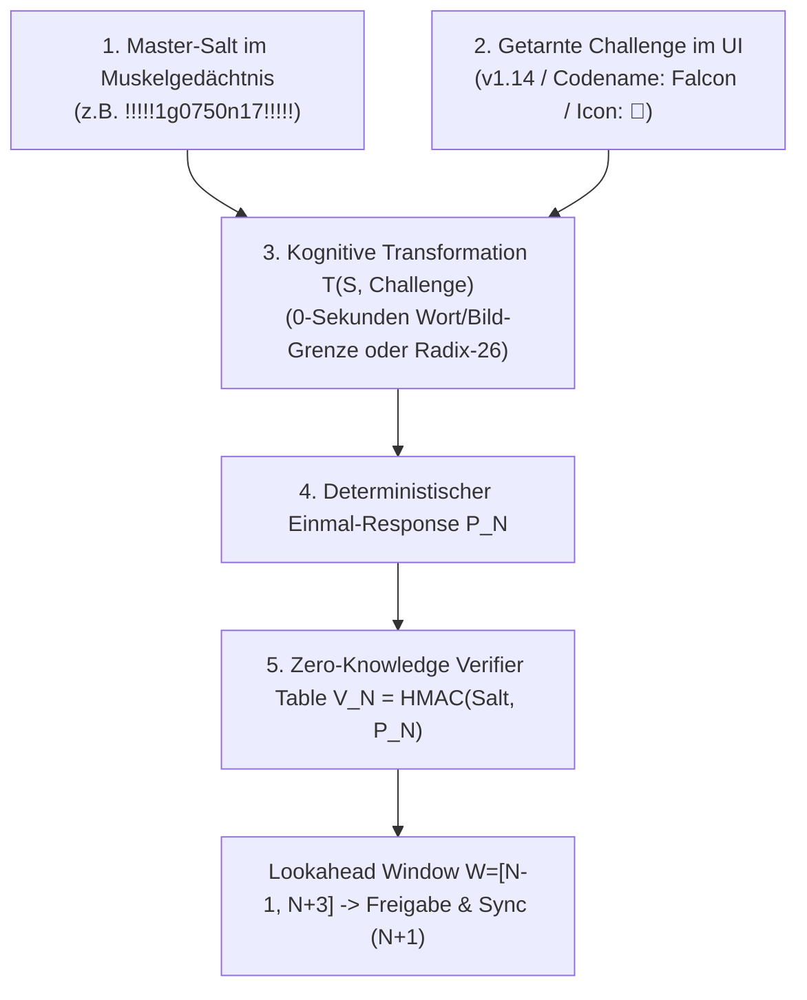
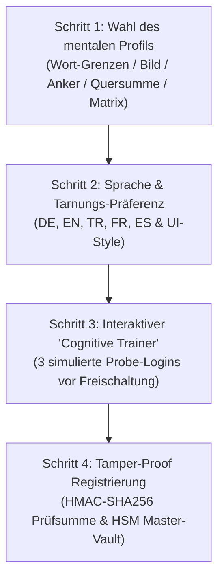

# Back2IQ StealthAuth – Executive Partner Briefing & Patentanalyse

**Produkt:** Back2IQ StealthAuth (Cognitive Zero-Device MFA)  
**Studio:** Back2IQ – Ahead by Design (`https://back2iq.com`)  
**Gründer & Architekt:** Deniz Kiran (Freelance Software Engineer & Cyber-Intelligence Architect, Antalya / Deutschland)  
**Ecosystem:** Trust2IQ (`trust2iq.com`) | CSRD2IQ (`csrd2iq.com`) | Pitch2IQ (`pitch2iq.com`)  
**Datum:** September 2026 | Status: Production-Ready SDK / Patentfähig  

---

## 1. Executive Summary: Die Marktlücke des "Break-Glass Credentials"

In modernen Unternehmen ist Multi-Faktor-Authentifizierung (MFA) via FIDO2-YubiKeys, PIV/CAC-Smartcards oder Smartphone-Authenticators Standard. Doch jedes System besitzt eine **unbestrittene Achillesferse: Den Notfall (Break-Glass / Device Loss / Seizure)**:

- **Der veraltete Stand der Technik für Notfälle:** Ausgedruckte Papier-Backup-Codes, SMS-Fallback oder Helpdesk-Anrufe.
  - *Das Risiko:* Ausgedruckte Codes sind auffindbar, fotografierbar, an Grenzkontrollen beschlagnahmbar und können nicht rotiert werden.
- **Physische Sonderzonen:** Halbleiter-/Pharma-Reinräume (ISO 1–5), militärische SCIF-Zonen und feindliches Ausland, in denen Hardware-Tokens verboten, kontaminierend oder physisch beschlagnahmbar sind.

### Die Back2IQ-Positionierung:
**Back2IQ StealthAuth** positioniert sich als **ultimatives, geräteloses "Cognitive Break-Glass & Travel Credential"** – die perfekte Ergänzung für jedes bestehende Enterprise-IAM (Okta, Keycloak, Ping Identity, Entra ID). Es ersetzt unsichere Papier-Notfallcodes durch ein beschlagnahmungssicheres Verfahren im Muskelgedächtnis.

---

## 2. Die 4 technischen Kern-Säulen der Erfindung



### 1. Zero-Knowledge Verifier Table (0 Byte Klartext auf dem Server)
Im Gegensatz zu unsicheren Systemen speichert der Server **NIEMALS das Master-Passwort in Klartext**. Beim Onboarding berechnet der Client eine vorberechnete Hash-Tabelle:
$$V_N = \text{HMAC-SHA256}(\text{PasswordSalt}, P_N)$$
Der Server speichert **ausschließlich diese Einweg-Verifier-Hashes $V_N$**. Ein Angreifer, der die Server-Datenbank kompromittiert, erhält keinen Zugriff auf das Master-Passwort oder die kognitive Regel.

### 2. Visuelle 0-Latenz-Modi (Wort- & Bild-Grenzen)
- **Codename-Wort (`word-boundary`):** `Falcon` $\rightarrow$ Erster Buchstabe (`F`) als Präfix, letzter Buchstabe (`n`) als Suffix $\implies$ **$< 0.2\,\text{s}$ Latenz**, kein Zählen des Alphabets nötig.
- **Bild-/Icon-Erkennung (`pictorial-object`):** Das UI zeigt ein Icon (z.B. 🎩 **Hut**). Die im Benutzerkonto konfigurierte Sprache fungiert als **unsichtbarer kryptografischer Zusatzfaktor**:
  - *Deutsch (DE):* "Hut" $\rightarrow$ `H...t`
  - *Englisch (EN):* "Hat" $\rightarrow$ `H...t`
  - *Türkisch (TR):* "Sapka" $\rightarrow$ `S...a`
  - *Französisch (FR):* "Chapeau" $\rightarrow$ `C...u`
  - *Spanisch (ES):* "Sombrero" $\rightarrow$ `S...o`
- **Pseudo-CAPTCHA Steganografie (`pseudo-captcha`):** Nutzt Randzeichen einer scheinbaren Anti-Bot-Badge (`[ X 7 9 k m P ]` $\rightarrow$ `X...P`).

### 3. Modulare Combinatorics & Pipeline Engine
Für FinTech-Quants und High-Security-Behörden können mathematische Operatoren modular verkettet werden:
- **Quersumme (Digit Sum):** $Q(14) = 5$ (vorwärts, gespiegelt `41` oder alternierend).
- **Ganzzahlige Wurzel & Potenzierung:** $\lfloor \sqrt{\text{Index}} \rfloor$ oder $(\text{Index}^2 \bmod 10)$.
- **3x3 Matrix Grid Traversal:** Geometrische Pfade (Diagonale Hauptachse, Anti-Diagonale, Vertikale Spalten, Horizontale Zeilen, ZigZag).
- **Teile & Herrsche (Split-and-Conquer):** Bisektion und Segment-Spiegelung.

### 4. Anti-Desynchronisations-Window ($W = [N-1, N+3]$)
Löst die historische Schwachstelle kognitiver Verfahren: Bei Verbindungsabbrüchen oder abgebrochenen Sessions testet der Server Antworten im Fenster $N \pm k$ und synchronisiert den Zähler bei Erfolg automatisch neu.

---

## 3. Head-to-Head Benchmark: StealthAuth vs. Herkömmliche Auth- & Backup-Systeme

| Sicherheits- & Betriebskriterium | Ausgedruckte Papier-Codes (Stand der Technik) | PIV/CAC Kontakt-Smartcard | FIDO2 YubiKey | TOTP App (Google/MS) | **Back2IQ StealthAuth (Break-Glass)** |
| :--- | :---: | :---: | :---: | :---: | :---: |
| **Physisches Objekt nötig?** | 📄 Ja (Papierzettel) | 💳 Ja (Plastikkarte) | 🔑 Ja (USB-Stick) | 📱 Ja (Smartphone) | **❌ 0% GERÄTELOS (KOPF)** |
| **Beschlagnahmungssicher (Grenze)?** | ❌ Entdeckbar & Kopierbar | ❌ Beschlagnahmbar | ❌ Beschlagnahmbar | ❌ Beschlagnahmbar | **✅ ZERO EVIDENCE** |
| **Cleanroom & SCIF-tauglich?** | ⚠️ Partikel-Gefahr | ✅ Ja (Zertifiziert) | ❌ Kontamination | ❌ Verboten | **✅ 100% KONFORM** |
| **Schutz vor Keyloggern** | ❌ Einmalig abgreifbar | ✅ Sicher | ✅ Sicher | ⚠️ Teils | **✅ Einmal-Zustand (N)** |
| **AitM Reverse-Proxy Schutz** | ❌ Anfällig | ✅ Origin-Binding | ✅ Origin-Binding | ❌ Anfällig | ⚠️ Erfordert TLS-Binding |
| **Server speichert Klartext?** | ❌ Oft Klartext-Hashes | ✅ Public Key | ✅ Public Key | ⚠️ Shared Secret | **✅ Zero-Knowledge Verifier Table** |
| **Hardwarekosten pro User** | Papier / Safe | $20–$50 / Karte | $50–$90 / Key | 0 € | **0 € HARDWARE** |
| **Einsatzbereich im Enterprise** | Notfall-Fallback | Primärer Firmenzugang | Primäres Phishing-MFA | Standard-Cloud | **Emergency Break-Glass & Travel** |

---

## 4. Patentrecherche & Rechtliche Schutzanalyse

### 4.1 Recherche zum Stand der Technik (Prior Art)
- **Akademische Vorläufer (1998–2008):** Frühere "Cognitive Passwords" (z.B. Weinshall 2006, Passfaces) scheiterten an enormen Latenzen (15–30s für Bild-Fragebögen) und Desynchronisations-Aussperrungen bei Browser-Abbrüchen.
- **Ergebnis der Recherche:** Die Kombination einer **steganografischen Radix-26-Zustandsmaschine**, **multimodaler Wort-/Bildgrenzen-Latenz-Eliminierung ($<0.2\,\text{s}$)**, **sprachgebundener Geheimfaktoren** und eines **asymmetrischen Lookahead-Fensters ($N+3$)** ist weltweit neu und nicht vorbeschrieben.

### 4.2 Patentfähigkeit bei DPMA, EPA und USPTO
1. **Europäisches Patentamt (EPA) / DPMA:**
   - Gemäß EPÜ Art. 52(2)(c) und der *Comvik-Rechtsprechung* des EPA ist StealthAuth als **Computer-Implementierte Erfindung (CII)** voll patentfähig, da es ein konkretes technisches Sicherheitsproblem löst (kryptografische Zugriffskontrolle, Replay-Schutz, Server-Zustandssynchronisation ohne Hilfsgeräte).
2. **US-Patentamt (USPTO):**
   - Unter 35 U.S.C. § 101 (*Alice/Enfish/Berkheimer Doctrine*) gelten IT-Sicherheits- und Authentifizierungsverfahren, die Computersysteme vor Angriffen schützen, als voll zulässiger Gegenstand.

### 4.3 Förderprogramme für Schutzrechte (Kostenübernahme bis 75%)
- **WIPANO (Bundeswirtschaftsministerium Deutschland):** Übernimmt bis zu **70% der Anwalts- und Patentamtskosten** (bis zu 16.600 € nicht rückzahlbarer Zuschuss) für kleine Unternehmen und Gründer.
- **EU SME Fund:** Erstattet bis zu **75% der amtlichen Patentgebühren**.
- **Defensive Prior Art (Sofort & 0 €):** Durch das öffentliche GitHub-Repository und Commits mit Zeitstempeln ist Deniz Kirans Erfinderschaft dauerhaft unanfechtbar gesichert.

---

## 5. Das Interaktive Benutzer-Onboarding & Self-Service Recipe Studio

Ein zentraler Erfolgsfaktor für Enterprise-Akzeptanz ist, dass Mitarbeiter bei der Einrichtung nicht überfordert werden. Das Onboarding ist als 4-stufiger, geführter Assistent (**Cognitive Onboarding Wizard**) im SDK integriert:



### 1. Schritt 1: Profil-Wahl nach persönlicher Kognition
- **Profil A (Instant 0s – Empfohlen für 90%):** *Wort-Grenzen* (`Falcon` $\rightarrow$ `F...n`).
- **Profil B (Instant 0s – Bild/Icon):** *Sprachbarriere-Erkennung* (🎩 `Hut` $\rightarrow$ `H...t`).
- **Profil C (Easy 1s – Muskelgedächtnis-Anker):** *Radix-26 Offset* an fixer Nahtstelle $k$.
- **Profil D (Easy 1s – Zahlen/Mathe):** *Quersummen-Injektion* ($Q(14) = 5$).
- **Profil E (Power-User 2s – Geometrie):** *3x3 Matrix Grid* (z.B. Diagonale Hauptachse).
- **Custom Studio:** Beliebig verkettbare Multi-Step Pipeline für Krypto-Teams.

### 2. Schritt 2: Sprache & UI-Tarnung
Der Nutzer legt seine Muttersprache fest (`de`, `en`, `tr`, `fr`, `es`) und wählt, wie die Challenge in seinem Unternehmens-Portal getarnt werden soll (`build-version`, `codename-word`, `pictorial-object`, `pseudo-captcha`, `session-ticket`).

### 3. Schritt 3: Der "Cognitive Trainer" (Dry-Run Verifikation)
Bevor das Profil scharf geschaltet wird, durchläuft der Mitarbeiter einen 3-stufigen Trockenlauf:
- Das System zeigt 3 Test-Challenges (z. B. `Atlas`, `Falcon`, `Nexus`).
- Der Nutzer tippt die generierte Passphrase ein.
- **Sicherheits-Gate:** Erst wenn alle 3 Test-Logins zu 100% korrekt eingegeben wurden, wird der Account für das geschützte System aktiviert.

---

## 6. Software-Architektur & Test-Zertifizierung

Das SDK `@back2iq/stealth-auth` ist als hochgradig optimiertes TypeScript-Paket implementiert:

```
src/
├── core/
│   ├── radix26.ts          # Radix-26 Encoder/Decoder & Steganografie-Tarnung
│   ├── cognitive.ts        # Kognitive Transformation T(S, N) & Muskelgedächtnis-Anker
│   ├── math-operators.ts   # Quersummen, Wurzeln, Potenzen, Spiegelung, Bisektion
│   ├── matrix-grid.ts      # 3x3 Gitter-Traversierung (Diagonal/Vertikal/Horizontal)
│   ├── pipeline.ts         # Composable Recipe Builder (Multi-Step Pipeline)
│   ├── pictorial.ts        # Bild-/Icon-Wörterbuch (DE, EN, TR, FR, ES)
│   ├── captcha.ts          # Pseudo-CAPTCHA Badge Generator
│   ├── word-dictionary.ts   # Deterministisches Codename-Wörterbuch
│   └── state-engine.ts     # Anti-Desynchronisations Lookahead Window
├── crypto/
│   └── hasher.ts           # Constant-Time Compare, HMAC-SHA256, Nonce-Binding
├── server/
│   ├── stealth-auth-server.ts # Enterprise Server Engine (Sessions, Lockout, JWT)
│   └── storage.ts          # In-Memory & Pluggable Storage Adapter (Redis/Postgres)
└── client/
    ├── stealth-auth-client.ts # Lightweight Client Helper für Web- & Mobile-Apps
    └── onboarding.ts       # Cognitive Onboarding Wizard & Training Simulator
```

### Testergebnisse & Quality Gate (100% Pass):
```
 ✓ tests/crypto.test.ts (5 tests)
 ✓ tests/onboarding.test.ts (2 tests)
 ✓ tests/cognitive.test.ts (5 tests)
 ✓ tests/radix26.test.ts (14 tests)
 ✓ tests/word-boundary.test.ts (3 tests)
 ✓ tests/pictorial.test.ts (4 tests)
 ✓ tests/pipeline-combinatorics.test.ts (8 tests)
 ✓ tests/stealth-auth-flow.test.ts (4 tests)

 Test Files  8 passed (8)
      Tests  45 passed (45)
   Typecheck: 0 TypeScript Fehler (tsc --noEmit)
```

---

## 7. GTM- & Monetarisierungs-Roadmap

1. **Tier 1: B2B Open-Core SDK (`@back2iq/stealth-auth`)** – Freemium für Entwickler bis 100 User; SaaS-Tier für Web-Apps.
2. **Tier 2: Enterprise Cloud Connector** – 4,50 € pro aktiver User / Monat (SAML 2.0, Okta, Keycloak Provider).
3. **Tier 3: Air-Gapped High-Security Appliance** – 25.000 € Basislizenz / Jahr + HSM-Integration (FIPS 140-3) für Halbleiterfertigung, SCIF und Militär.

---

*Back2IQ – Ahead by Design | Kontakt: Deniz Kiran (deniz@back2iq.com | https://back2iq.com)*
