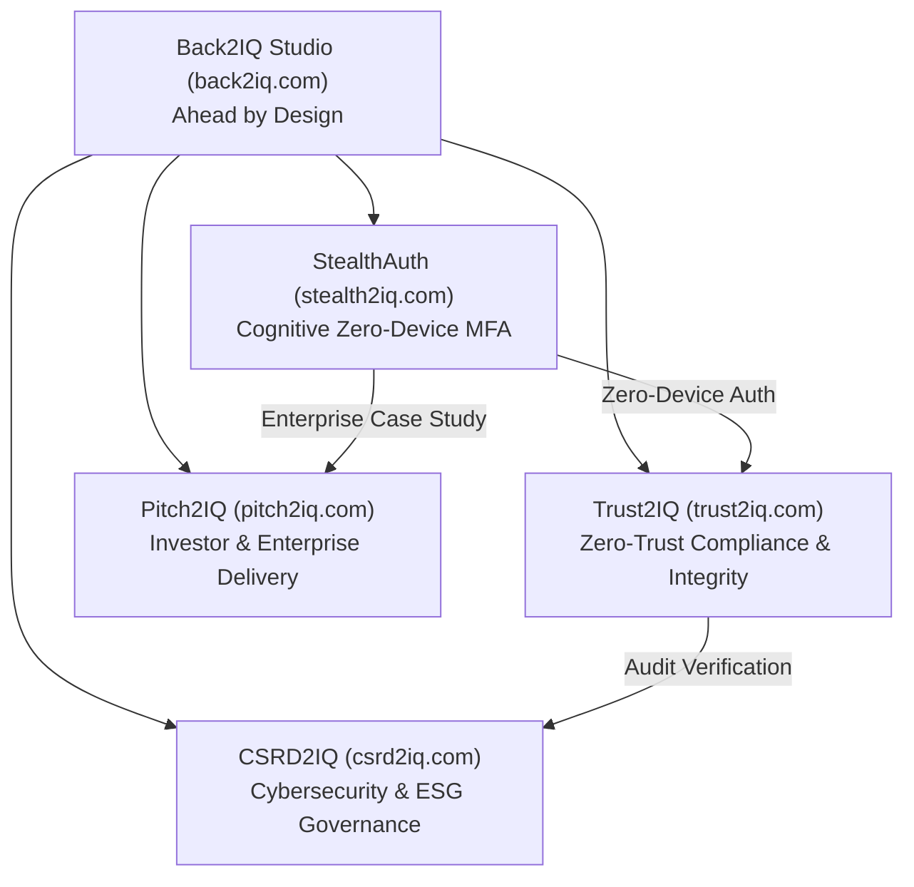

# Back2IQ StealthAuth – Go-To-Market & Monetarisierungs-Roadmap

**Ecosystem:** Back2IQ Studio (`https://back2iq.com`)  
**Founder:** Deniz Kiran (Freelance Software Engineer & Cyber-Intelligence Architect, Antalya, Turkey)  
**Positionierung:** "Zero-Device Cognitive MFA for Air-Gapped & High-Threat Operating Environments"

---

## 1. Problemstellung im Enterprise-Markt (Die MFA-Paradoxie)

In modernen Unternehmen gilt Multi-Faktor-Authentifizierung (MFA) als Pflicht. Jedoch führen bestehende MFA-Lösungen (SMS, TOTP Apps, FIDO2 Hardware-Tokens) in kritischen Sektoren zu massiven operationalen Blockaden und Sicherheitsrisiken:

| Problemfeld | Physische Barriere herkömmlicher MFA | StealthAuth Cognitive MFA Lösung |
| :--- | :--- | :--- |
| **Halbleiter- & Pharma-Reinräume (ISO 1-5)** | Smartphones/Kameras streng verboten; Hardware-Keys kontaminieren Reinraum-Atmosphäre. | **100% gerätelos.** Zugriff erfolgt ausschließlich über Kopf + Tastatur. |
| **Militär, Defense & SCIF-Räume** | Funksignale (BLE, NFC, WLAN, Mobilfunk) sind physisch unterbunden (EMP- & Faraday-Käfige). | **Keine Funkwellen.** Funktioniert vollständig air-gapped auf isolierten Terminals. |
| **Executive & VIP Travel (Feindstaaten)** | Border Guards & Geheimdienste beschlagnahmen Hardware und erzwingen Biometrie/Tokens. | **Zero-Evidence.** Kein Token im Gepäck, kein verdächtiger Authenticator auf dem Smartphone. |
| **Kosten & Logistik von YubiKeys** | Hardware-Verlust, Versandkosten, Schlüssel-Initialisierung, Ausfallzeiten ($50–$90/Mitarbeiter/Jahr). | **Zero Hardware Cost.** Skalierbare Software-Lizenz, sofortige weltweite Bereitstellung. |

---

## 2. Produkt-Packaging & Tier-Architektur

### Tier 1: StealthAuth Developer & Core SDK (Open-Core / B2B)
- Paket: `@back2iq/stealth-auth` (TypeScript / Node / Python / Go)
- Zielgruppe: SaaS-Entwickler, FinTechs, IAM-Anbieter (Auth0, Okta, Keycloak Plugins)
- Lizenz: Freemium bis 100 Active Users; danach Volume-based API Pricing.

### Tier 2: StealthAuth Enterprise Suite (Cloud & Hybrid)
- **Features:**
  - Standard IdP Connector (SAML 2.0 / OIDC / OAuth2 Proxy).
  - Web & Mobile Cognitive Stealth Widgets (Steganografische Hints wie `v1.14` oder `Build #14`).
  - Automated Lookahead Windowing & Self-Service Resync Portal.
  - Audit Logging & SIEM Integration (Splunk, Datadog, Microsoft Sentinel).
- **Preis:** 4,50 € pro geschützter User / Monat (jährliche Abrechnung).

### Tier 3: StealthAuth Air-Gapped Appliance (Defense / Critical Infrastructure)
- **Features:**
  - 100% Offline-fähige Docker/Kubernetes Appliance ohne jegliche externe Internetverbindung.
  - HSM-Integration (Hardware Security Module nach FIPS 140-3 Level 4) zur Speicherung der Master-Vaults.
  - Hardened Multi-Tenant Isolation & Role-Based Access Control (RBAC).
- **Preis:** 25.000 € Basislizenz / Instanz / Jahr + 6,00 € pro High-Security Seat / Monat.

---

## 3. Synergien im Back2IQ Ecosystem

---

## 4. Phase-by-Phase Roadmap (Q3 2026 – Q4 2027)

### Phase 1 (Q3 2026): Foundation, SDK & Patent Filing
- [x] Mathematische Spezifikation & Radix-26 Zustandsmaschine fertiggestellt.
- [x] TypeScript B2B SDK (`@back2iq/stealth-auth`) mit 100% Testabdeckung und Zero-Type-Errors.
- [x] DPMA/EPA/USPTO Patentanmeldungs-Schriftstück finalisiert.
- [ ] Erstellung der Landing Page & interaktiven Demo auf `back2iq.com/stealth-auth`.

### Phase 2 (Q4 2026): Enterprise Integration Plugins
- Keycloak Extension (`stealthauth-keycloak-provider.jar`).
- Okta / Auth0 Custom Action Integration Templates.
- Linux PAM-Modul (`pam_stealthauth.so`) für Air-Gapped Server SSH & Terminal Logins.

### Phase 3 (Q1–Q2 2027): Defense & Cleanroom Pilotierung
- Pilotprojekte mit 3 Halbleiter-/Reinraum-Kunden in DACH & Benelux (z.B. Dresden Silicon Saxony, ASML Zulieferer).
- Zertifizierung nach BSI IT-Grundschutz & Common Criteria EAL4+.

### Phase 4 (Q3–Q4 2027): Global Scale & Executive Travel Expansion
- Rollout des "Executive Travel Mode" für internationale Wirtschaftskanzleien, Private Equity und Diplomaten.
- Integration von Dynamic Multi-Anchor Permutationen für Ultra-High-Entropy Anforderungen ($>150$ Bits).
